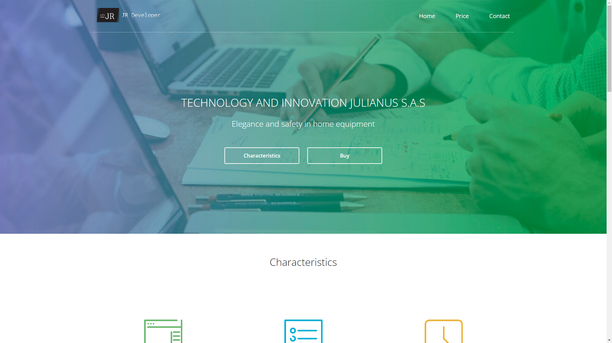
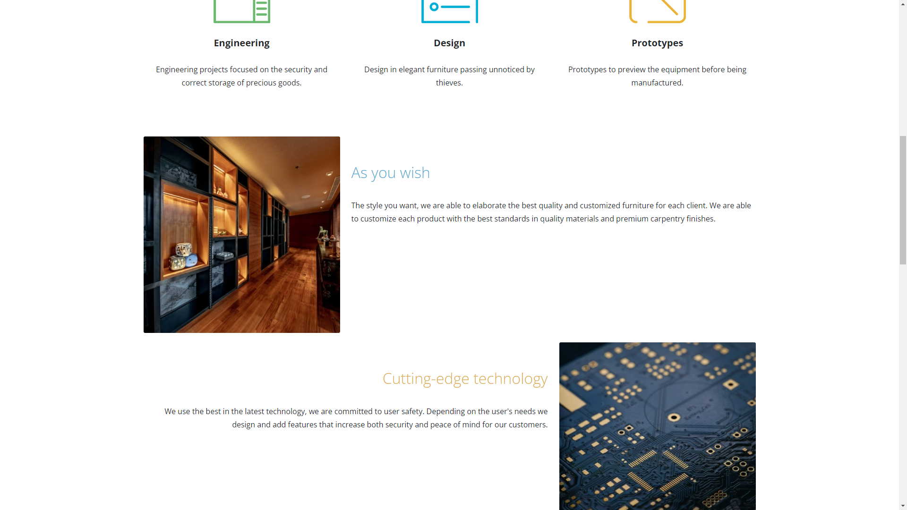
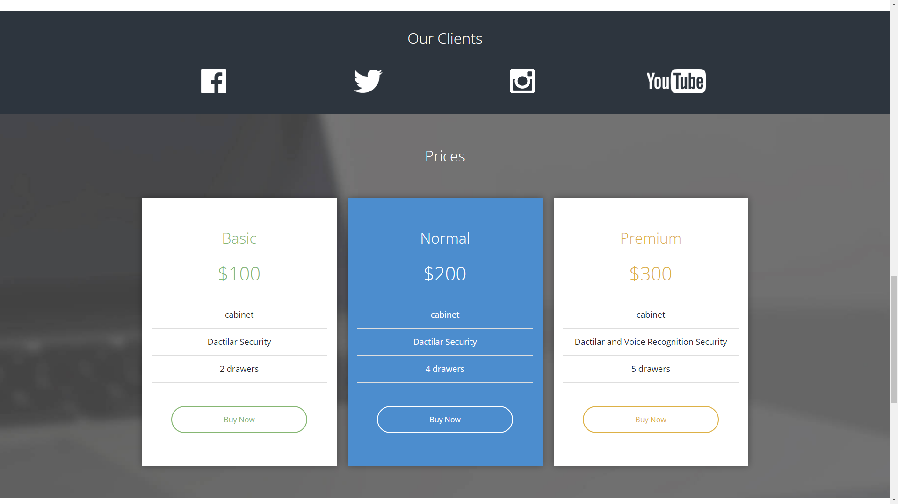
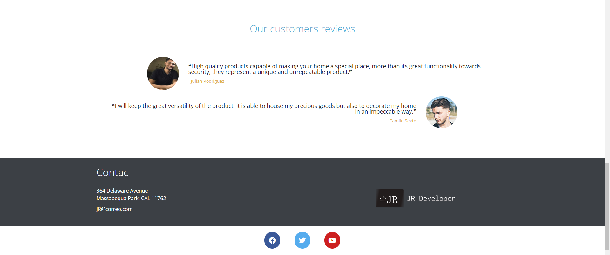

# startup
Web Page for a startup company using Bootstrap and Fontawesome libraries

# Libraries

Bootstrap
Fontawesome

***Those libraries are already on the project, so it's not necessary to install them***

# Web Page

[Startup](https://jare9716.github.io/startup/)

# Images

 &nbsp;&nbsp;&nbsp;&nbsp;
 &nbsp;&nbsp;&nbsp;&nbsp;
 &nbsp;&nbsp;&nbsp;&nbsp; 
 &nbsp;&nbsp;&nbsp;&nbsp; 
